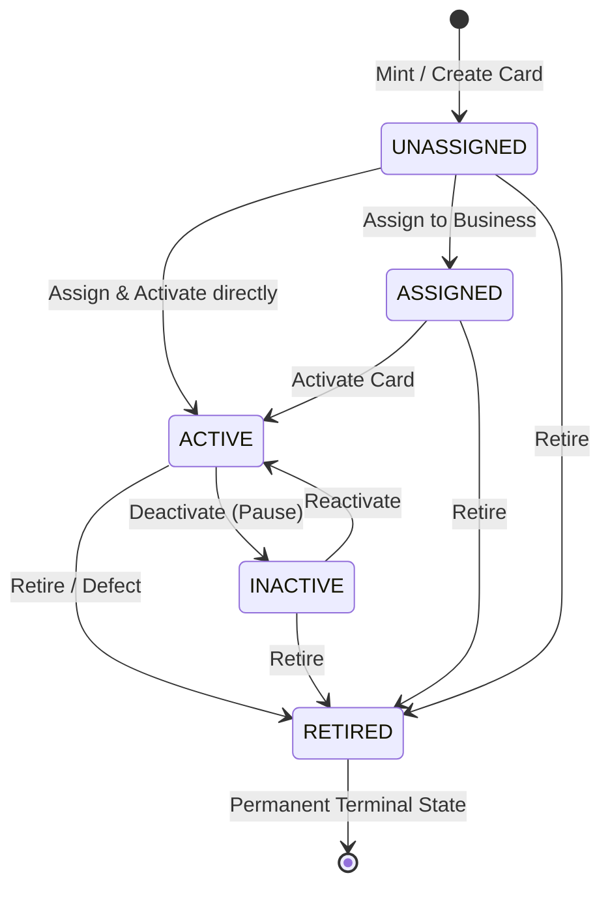

# REVIEWTAP — Phase 3 Architecture Readiness Report

**Phase:** Phase 3 — NFC Product Management & Card Lifecycle  
**Product Name:** ReviewTap  
**Tagline:** *Tap. Scan. Review.*  
**Author:** Senior Software Architect, Security Engineer, Database Architect & QA Lead  
**Document Version:** 3.0.0  
**Date:** September 20, 2026  
**Status:** Audit Complete — Ready for Review & Batch Execution  

---

## 1. Executive Summary & Audit Overview

ReviewTap has successfully implemented Phase 1 (Foundation & Review Flow) and Phase 2 (Business Management & Analytics). The system operates on a clean layered architecture (`Router -> Middleware -> Controller -> Service -> Repository -> Prisma -> PostgreSQL`) with strict multi-tenant authorization.

This audit evaluates the system against the authoritative **ReviewTap Coding Standard** (`docs/standards/codingStandard.md`) and designs the dedicated **NFC Product Management & Card Lifecycle** subsystem.

### Audit Findings Summary
1. **Existing NFC Support (Phases 1 & 2)**:
   - In Phase 1 & 2, NFC taps were captured via `/r/:slug?src=NFC`.
   - `ScanEvent` recorded `sourceType: 'NFC'` and `tapSourceId`.
   - However, physical NFC cards could not exist in inventory independently of a business, lacked public card identifiers (e.g. `RT-NFC-XXXXXX`), had no explicit lifecycle states (`UNASSIGNED`, `ASSIGNED`, `ACTIVE`, `INACTIVE`, `RETIRED`), and could not be reassigned or retired individually.
2. **Phase 3 NFC Domain Entity**:
   - A dedicated `NfcCard` model will be introduced into PostgreSQL via forward-only schema expansion.
   - Preserves `TapSource` and `ScanEvent` integrity without dropping tables or breaking Phase 1 & 2 QR/telemetry flows.
   - Dedicated routing endpoint `/r/nfc/:publicId` will resolve cards, validate status, verify assigned business, log asynchronous telemetry, and execute an instant HTTP 302 redirect.

---

## 2. Existing System Architecture vs. Phase 3 Requirements

| Dimension | Phase 2 Baseline | Phase 3 Target Architecture |
| :--- | :--- | :--- |
| **NFC Entity** | Implicit via `TapSource(type: NFC_CARD)` tied to a business. | First-class `NfcCard` model with lifecycle timestamps (`activatedAt`, `deactivatedAt`, `retiredAt`). |
| **Public Card ID** | None (used business slug or generic short code). | Unique, URL-safe, physical-label friendly identifier: `RT-NFC-XXXXXX`. |
| **Lifecycle States** | Binary `isActive: Boolean`. | Explicit state machine: `UNASSIGNED`, `ASSIGNED`, `ACTIVE`, `INACTIVE`, `RETIRED`. |
| **Card Assignment** | Tied at business creation time. | Decoupled: cards can be minted unassigned, assigned to any owned business, reassigned, or retired. |
| **NFC Redirect Engine** | `/r/:slug?src=NFC` | Dedicated `/r/nfc/:publicId` validating card state and business status before redirecting. |
| **Security Controls** | Ownership checked per business. | Ownership checked per business assignment; open redirect injection strictly prohibited. |
| **NFC Management UI** | Integrated in business page only. | Dedicated `/dashboard/nfc` directory and `/dashboard/nfc/:id` detail studio. |

---

## 3. Database Schema Changes (Forward-Only & Non-Destructive)

In strict accordance with Rule 15 of the Coding Standard, all database modifications are **forward-only**:

```prisma
enum NfcCardStatus {
  UNASSIGNED
  ASSIGNED
  ACTIVE
  INACTIVE
  RETIRED
}

model NfcCard {
  id            String        @id @default(uuid())
  publicId      String        @unique // e.g. RT-NFC-8A2F1C
  label         String        @default("ReviewTap NFC Card")
  status        NfcCardStatus @default(UNASSIGNED)
  nfcTagUid     String?       @unique // Optional hardware chip UID
  businessId    String?       // Nullable for UNASSIGNED inventory cards
  batchNumber   String?       // Manufacturing batch tracking
  activatedAt   DateTime?
  deactivatedAt DateTime?
  retiredAt     DateTime?
  createdAt     DateTime      @default(now())
  updatedAt     DateTime      @updatedAt

  business      Business?     @relation(fields: [businessId], references: [id], onDelete: SetNull)
  scanEvents    ScanEvent[]

  @@index([publicId])
  @@index([businessId])
  @@index([status])
  @@index([createdAt])
  @@map("nfc_cards")
}

model ScanEvent {
  // Existing fields retained...
  nfcCardId     String?       // Optional relation to NfcCard
  nfcCard       NfcCard?      @relation(fields: [nfcCardId], references: [id], onDelete: SetNull)

  @@index([nfcCardId, createdAt])
}

model Business {
  // Existing fields retained...
  nfcCards      NfcCard[]     // 1-to-many relation to assigned NFC cards
}
```

---

## 4. NFC State Machine & Lifecycle Transitions



### Transition Validation Rules (Rule 7)
- **UNASSIGNED**: Card exists in digital inventory without a business. Cannot redirect (`HTTP 404 / Controlled Inactive`).
- **ASSIGNED**: Linked to a business, pending activation. Cannot redirect until activated.
- **ACTIVE**: Fully functional; taps redirect to Google Review page and log telemetry.
- **INACTIVE**: Temporarily paused by business owner; displays controlled inactive message.
- **RETIRED**: Card marked damaged, lost, or decommissioned. Irreversible terminal state; can never be reactivated.

---

## 5. Security & Redirect Architecture

1. **Strict Open-Redirect Prevention (Rule 21)**:
   - `/r/nfc/:publicId` **never** accepts destination URLs from client queries (e.g. `?redirect=...`).
   - Destination is always resolved server-side from `NfcCard.business.googleReviewUrl`.
2. **Multi-Tenant Ownership Verification (Rule 8 & 9)**:
   - Business Owners can only assign cards to businesses where `Business.ownerId === req.user.id`.
   - Business Owners can only view and manage cards assigned to their owned businesses.
   - Super Admins can manage all cards, unassigned inventory, and batch provisioning.
3. **Controlled Inactive Response (Rule 12)**:
   - Unassigned, inactive, or retired cards render a branded, user-friendly notice without exposing internal database errors or stack traces.

---

## 6. Phase 3 API Specifications

### NFC Management APIs
- `GET /api/nfc` — List NFC cards (scoped by owner; Super Admin sees all; search by publicId/label; filter by status/businessId; paginated).
- `POST /api/nfc` — Create NFC card (generates `publicId: RT-NFC-XXXXXX`, optional initial business assignment & activation).
- `GET /api/nfc/:id` — Get NFC card details, assigned business, tap telemetry, and analytics.
- `PATCH /api/nfc/:id` — Update card label or notes.
- `POST /api/nfc/:id/assign` — Assign/reassign card to a business (verifies ownership).
- `POST /api/nfc/:id/activate` — Transition to `ACTIVE`.
- `POST /api/nfc/:id/deactivate` — Transition to `INACTIVE`.
- `POST /api/nfc/:id/retire` — Transition to `RETIRED`.
- `GET /api/nfc/:id/qr` — Generate QR code image of the card's NFC redirect URL (`/r/nfc/:publicId`).

### NFC Redirect Endpoint
- `GET /r/nfc/:publicId` — Resolves card, validates active status and business, logs async telemetry, executes HTTP 302 redirect.

---

## 7. Frontend Architecture & Routes

| Route | Page Component | Access | Description |
| :--- | :--- | :---: | :--- |
| `/dashboard/nfc` | `NfcDashboardPage` | Protected | NFC card registry, status filtering, batch search, quick lifecycle actions. |
| `/dashboard/nfc/:id` | `NfcDetailPage` | Protected | Card profile, NFC URL copy, QR backup viewer, 14-day tap analytics, lifecycle controls. |
| `/dashboard/businesses/:id` | `BusinessDetailPage` | Protected | Integrated NFC Cards tab showing cards assigned to the location. |

---

## 8. Regression Risks & Mitigations

1. **Phase 1 QR Redirection**:
   - Primary QR codes point to `/r/:slug`. Phase 3 adds `/r/nfc/:publicId` without altering `/r/:slug`.
2. **Phase 2 Telemetry & Analytics**:
   - `ScanEvent` adds `nfcCardId` as an optional foreign key.
   - Existing queries (`sourceType: 'QR'` / `'NFC'`) continue working seamlessly.
3. **Database Performance**:
   - Indices on `NfcCard(publicId)`, `NfcCard(businessId)`, `NfcCard(status)`, and `ScanEvent(nfcCardId, createdAt)` ensure sub-millisecond lookups.
